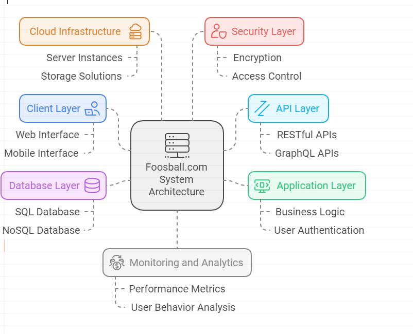

# System Architecture Overview
## Foosball.com

The architecture of Foosball.com consists of several key components that work together to deliver a seamless user experience. Below is a breakdown of the main elements of the system architecture:

> # ** 1 Client Layer**
>
> - Web Application: The front-end interface for users to interact with the platform. Built using modern frameworks like React or Angular, it provides a responsive design for both desktop and mobile users.
> - Mobile Application: A dedicated mobile app for iOS and Android, allowing users to access features on the go.
>

> # **2 API Layer**
>
> - RESTful API: A set of endpoints that facilitate communication between the client layer and the server. This layer handles requests for user data, game statistics, and community features.
>

> # ** 3 Application Layer**
>
  > - User Management Service: Manages user authentication, profiles, and permissions.
> - Game Management Service: Handles game data, including scores, player   statistics, and match history.
> - Content Management System (CMS): Manages articles, tutorials, and community posts related to foosball.
> - Notification Service: Sends alerts and updates to users regarding new content, events, or messages.

> # ** 4 Database Layer**
>
  > - Relational Database: Stores structured data such as user profiles, game statistics, and content. Technologies like PostgreSQL or MySQL can be used.
> - NoSQL Database: For unstructured data such as user-generated content, comments, and logs. MongoDB or Firebase can be utilized.

> # ** 5 Cloud Infrastructure**
>
  > - Hosting: The application is hosted on cloud platforms like AWS, Azure, or Google Cloud for scalability and reliability.
> - Load Balancer: Distributes incoming traffic across multiple servers to ensure high availability and performance.
> - Content Delivery Network (CDN): Caches static assets (images, scripts) to reduce load times and improve user experience

> # ** 6 Security Layer**
>
  > - Authentication and Authorization: Implements OAuth2 or JWT for secure user login and access control.
> - Data Encryption: Ensures sensitive data is encrypted both in transit and at rest.
> - Firewall and DDoS Protection: Protects the application from malicious attacks and unauthorized access.

> # ** 7 Monitoring and Analytics**
>
  > - Logging Service: Captures application logs for troubleshooting and performance monitoring.
> -Analytics Tools: Integrates with tools like Google Analytics or Mixpanel to track user engagement and behavior.

